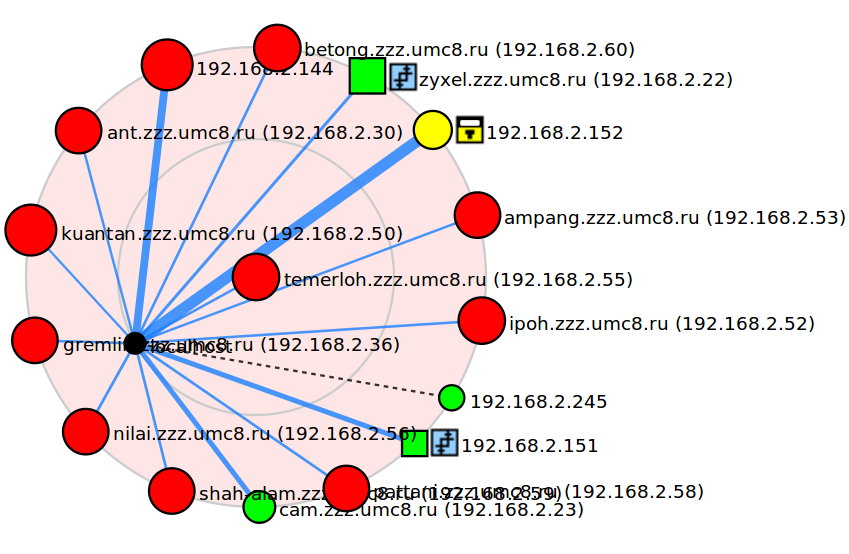
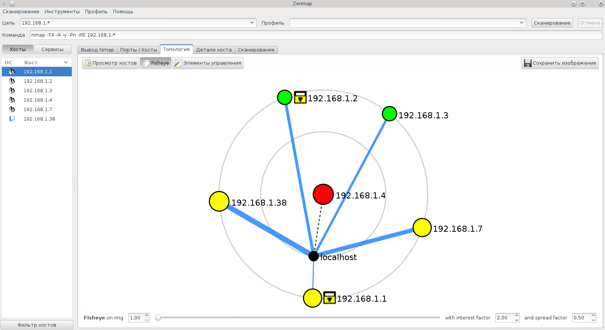
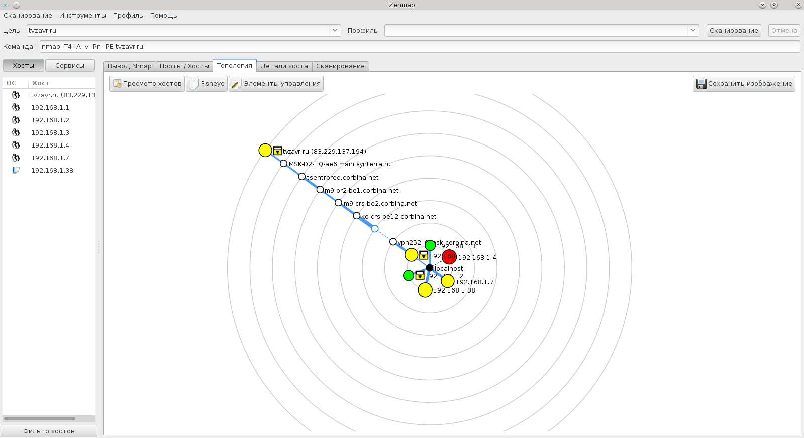

# Рекомендации

Для того, чтобы сделать выводы о факультетской сети было бы правильно 
самостоятельно выяснить как она работает. Сделать это можно, с помощью
набора команд, приведенного ниже. 

Например, с помощью команд можно строить изображение 
топологии сети лабораторного класса:

Тут показано устройство домашней беспроводной сети.
Про сканирование лабораторного класса можно прочитать 
в заметке [zzznet.md](./zzznet.md).

# Конфигурация сетевого интерфейса

## Общая

См. `man ifconfig`.

    $> ifconfig 

### Пример

    [w495@w495 ~]$ ifconfig 
    lo: flags=73<UP,LOOPBACK,RUNNING>  mtu 65536
            inet 127.0.0.1  netmask 255.0.0.0
            inet6 ::1  prefixlen 128  scopeid 0x10<host>
            loop  txqueuelen 0  (Local Loopback)
            RX packets 6520  bytes 663847 (648.2 KiB)
            RX errors 0  dropped 0  overruns 0  frame 0
            TX packets 6520  bytes 663847 (648.2 KiB)
            TX errors 0  dropped 0 overruns 0  carrier 0  collisions 0

    virbr0: flags=4099<UP,BROADCAST,MULTICAST>  mtu 1500
            inet 192.168.122.1  netmask 255.255.255.0  broadcast 192.168.122.255
            ether 52:54:00:3f:97:15  txqueuelen 0  (Ethernet)
            RX packets 0  bytes 0 (0.0 B)
            RX errors 0  dropped 0  overruns 0  frame 0
            TX packets 4  bytes 842 (842.0 B)
            TX errors 0  dropped 0 overruns 0  carrier 0  collisions 0

    wlan0: flags=4163<UP,BROADCAST,RUNNING,MULTICAST>  mtu 1500
            inet 192.168.1.4  netmask 255.255.255.0  broadcast 192.168.1.255
            inet6 fe80::208:caff:fe86:2e27  prefixlen 64  scopeid 0x20<link>
            ether 00:08:ca:86:2e:27  txqueuelen 1000  (Ethernet)
            RX packets 22835  bytes 18710913 (17.8 MiB)
            RX errors 0  dropped 0  overruns 0  frame 0
            TX packets 35926  bytes 5779561 (5.5 MiB)
            TX errors 0  dropped 0 overruns 0  carrier 0  collisions 0

## Беспроводной интерфейс

См. `man iwconfig`.

    $> iwconfig 

### Пример

    [w495@w495 ~]$ iwconfig 
    lo        no wireless extensions.

    virbr0-nic  no wireless extensions.

    virbr0    no wireless extensions.

    wlan0     IEEE 802.11bgn  ESSID:"lhst"  
              Mode:Managed  Frequency:2.462 GHz  Access Point: BC:76:70:06:2C:40   
              Bit Rate=27 Mb/s   Tx-Power=15 dBm   
              Retry  long limit:7   RTS thr:off   Fragment thr:off
              Power Management:on
              Link Quality=46/70  Signal level=-64 dBm  
              Rx invalid nwid:0  Rx invalid crypt:0  Rx invalid frag:0
              Tx excessive retries:4  Invalid misc:962   Missed beacon:0

# Сетевые службы на Вашем компьютере

## netstat

См. `man netstat`.

    $> sudo netstat -nap --inet --inet6  | grep -v "-"
    
Так мы получаем список всех соединений через IPv4 и IPv6 и выводим PID процесса,
и имя программы, которые держат эти соединения. Потом через `grep -v "-"`
фильтруем только те, для которых удалось определить имя.

### Пример

    [w495@w495 ~]$ netstat -nap --inet --inet6  | grep -v "-"
    Active Internet connections (servers and established)
    tcp        0      0 0.0.0.0:111             0.0.0.0:*               LISTEN      3463/rpcbind        
    tcp        0      0 127.0.0.1:5939          0.0.0.0:*               LISTEN      3458/teamviewerd    
    tcp        0      0 192.168.122.1:53        0.0.0.0:*               LISTEN      3602/dnsmasq        
    tcp        0      0 0.0.0.0:22              0.0.0.0:*               LISTEN      3465/sshd           
    tcp        0      0 0.0.0.0:631             0.0.0.0:*               LISTEN      1181/cupsd          
    tcp        0      0 127.0.0.1:5432          0.0.0.0:*               LISTEN      3475/postgres       
    tcp        0      0 0.0.0.0:56185           0.0.0.0:*               LISTEN      5267/skype          
    tcp        0      0 127.0.0.1:25            0.0.0.0:*               LISTEN      3545/sendmail: acce 
    tcp        0      0 0.0.0.0:17500           0.0.0.0:*               LISTEN      5917/dropbox        
    tcp        0      0 192.168.1.37:48613      108.160.166.140:443     ESTABLISHED 5917/dropbox        
    tcp        0      0 192.168.1.37:58138      91.190.216.56:12350     ESTABLISHED 5267/skype          
    tcp        0     48 192.168.1.37:44470      37.252.232.5:5938       ESTABLISHED 3458/teamviewerd    
    tcp6       0      0 :::514                  :::*                    LISTEN      3456/xinetd         
    tcp6       0      0 :::111                  :::*                    LISTEN      3463/rpcbind        
    tcp6       0      0 :::21                   :::*                    LISTEN      3444/vsftpd         
    tcp6       0      0 :::22                   :::*                    LISTEN      3465/sshd           
    tcp6       0      0 :::23                   :::*                    LISTEN      3456/xinetd         
    tcp6       0      0 :::631                  :::*                    LISTEN      1181/cupsd  

    
## lsof -i

Показывает список всех открытых портов в Интернет.

    $> lsof -i

### Пример

    [w495@w495 ~]$ lsof -i
    COMMAND    PID USER   FD   TYPE DEVICE SIZE/OFF NODE NAME
    wineserve 4328 w495   12u  IPv4  26103      0t0  TCP localhost.localdomain:5939 (LISTEN)
    skype     5267 w495   13u  IPv4  36900      0t0  UDP localhost.localdomain:49504 
    skype     5267 w495   29u  IPv4 297639      0t0  TCP 192.168.1.37:57129->bn1msgr2011808.gateway.edge.messenger.live.com:https (ESTABLISHED)
    skype     5267 w495   30u  IPv4 166333      0t0  TCP *:56185 (LISTEN)
    skype     5267 w495   34u  IPv4 166334      0t0  UDP *:56185 
    skype     5267 w495   36u  IPv4 298358      0t0  TCP 192.168.1.37:57026->111.221.77.170:40003 (ESTABLISHED)
    skype     5267 w495   37u  IPv4 337721      0t0  TCP 192.168.1.37:50356->91.190.218.58:12350 (ESTABLISHED)
    fedmsg-no 5565 w495   29u  IPv4 296410      0t0  TCP 192.168.1.37:51994->proxy5-2.fedoraproject.org:9940 (ESTABLISHED)
    dropbox   5917 w495   14u  IPv4 296724      0t0  TCP 192.168.1.37:37756->snt-re3-7d.sjc.dropbox.com:http (ESTABLISHED)
    dropbox   5917 w495   22u  IPv4  36458      0t0  UDP *:db-lsp-disc 
    dropbox   5917 w495   25u  IPv4  36461      0t0  TCP *:db-lsp (LISTEN)
    chrome    7198 w495  159u  IPv4 465964      0t0  TCP 192.168.1.37:41863->lb-in-f94.1e100.net:https (ESTABLISHED)
    chrome    7198 w495  214u  IPv4 472436      0t0  TCP 192.168.1.37:45014->lb-in-f95.1e100.net:http (ESTABLISHED)
    chrome    7198 w495  253u  IPv4 465193      0t0  TCP 192.168.1.37:59876->173.194.32.138:https (ESTABLISHED)
    chrome    7198 w495  281u  IPv4 465295      0t0  TCP 192.168.1.37:36960->lb-in-f94.1e100.net:http (ESTABLISHED)
    chrome    7198 w495  296u  IPv4 463469      0t0  TCP 192.168.1.37:55312->la-in-f156.1e100.net:http (ESTABLISHED)
    chrome    7198 w495  297u  IPv4 464646      0t0  TCP 192.168.1.37:33304->129.42.56.216:http (ESTABLISHED)

# Список точек WIFI

См. `man nmcli`. Утилиту `nmcli` может потребоваться установить.

    $> nmcli dev wifi list
    
### Пример

    [w495@w495 ~]$ nmcli dev wifi list
    SSID                              BSSID               РЕЖИМ            ЧАСТОТА    СКОРОСТЬ   СИГНАЛ   ЗАЩИТА     АКТИВЕН 
    'mgts-8'                          28:31:52:26:80:FD   Инфраструктура   2437 МГц   54 МБ/с    94       WPA        нет     
    'Leha'                            F8:C0:91:13:47:4F   Инфраструктура   2447 МГц   54 МБ/с    100      WPA2       нет     
    'TUSITA2'                         C8:60:00:E7:90:48   Инфраструктура   2462 МГц   54 МБ/с    74       WPA2       нет     
    'wifi85947'                       C4:3D:C7:54:54:C0   Инфраструктура   2417 МГц   54 МБ/с    65       WPA WPA2   нет     
    'Zivop_wifi'                      1C:7E:E5:B5:7B:41   Инфраструктура   2462 МГц   54 МБ/с    64       WPA2       нет     
    'mgts-26'                         E4:68:A3:00:9C:36   Инфраструктура   2437 МГц   54 МБ/с    50       WPA        нет     
    'mgts-29'                         E4:68:A3:00:BB:76   Инфраструктура   2437 МГц   54 МБ/с    50       WPA        нет     
    'mgts-12'                         28:31:52:26:32:8D   Инфраструктура   2437 МГц   54 МБ/с    45       WPA        нет     
    'mgts-21'                         28:31:52:25:E7:5B   Инфраструктура   2437 МГц   54 МБ/с    69       WPA        нет     
    'ZyXEL8777'                       40:4A:03:AE:AF:85   Инфраструктура   2437 МГц   54 МБ/с    37       WPA2       нет     
    'TP-LINK_CA3F12'                  A0:F3:C1:CA:3F:12   Инфраструктура   2462 МГц   54 МБ/с    35       WPA2       нет     
    'MGTS_1242573'                    34:6B:D3:C3:D0:8C   Инфраструктура   2417 МГц   54 МБ/с    29       WPA2       нет     
    'c2_free'                         00:27:22:E6:82:84   Инфраструктура   2437 МГц   54 МБ/с    100      --         нет     
    'c2_free'                         00:27:22:E6:82:48   Инфраструктура   2447 МГц   54 МБ/с    85       --         нет     
    'c2_free'                         A0:F3:C1:4F:00:D8   Инфраструктура   2452 МГц   54 МБ/с    70       --         нет     
    'c2_free'                         00:27:22:E6:80:9D   Инфраструктура   2462 МГц   54 МБ/с    79       --         нет     
    'c2_free'                         A0:F3:C1:4F:08:3C   Инфраструктура   2462 МГц   54 МБ/с    74       --         нет     
    'c2_free'                         00:27:22:E6:82:89   Инфраструктура   2412 МГц   54 МБ/с    69       --         нет     
    'c2_free'                         A0:F3:C1:59:D1:58   Инфраструктура   2422 МГц   54 МБ/с    65       --         нет     
    'c2_free'                         00:27:22:E6:80:23   Инфраструктура   2427 МГц   54 МБ/с    60       --         нет     
    'FON_MTS'                         BC:76:70:06:2C:43   Инфраструктура   2462 МГц   54 МБ/с    79       --         нет     
    'Irisha'                          90:F6:52:5B:CA:0C   Инфраструктура   2452 МГц   54 МБ/с    82       WPA WPA2   нет     
    'mgts-3'                          28:31:52:49:25:6A   Инфраструктура   2437 МГц   54 МБ/с    64       WPA        нет     
    'c2_free'                         00:27:22:E6:80:03   Инфраструктура   2462 МГц   54 МБ/с    65       --         нет     
    'Irisha'                          74:EA:3A:ED:C0:70   Инфраструктура   2452 МГц   54 МБ/с    75       WPA WPA2   нет     
    'mgts-22'                         28:31:52:26:32:B5   Инфраструктура   2462 МГц   54 МБ/с    67       WPA        нет     
    'lhbe'                            14:A9:E3:00:26:D2   Инфраструктура   2412 МГц   54 МБ/с    62       WPA WPA2   нет     
    'c2_free'                         00:27:22:E6:8C:CF   Инфраструктура   2422 МГц   54 МБ/с    65       --         нет     
    'Beeline_router'                  00:14:D1:65:92:AD   Инфраструктура   2452 МГц   54 МБ/с    59       WPA2       нет     
    'lhst'                            BC:76:70:06:2C:40   Инфраструктура   2462 МГц   54 МБ/с    49       WPA2       да      
    'mgts-11'                         E4:68:A3:B2:30:9B   Инфраструктура   2462 МГц   54 МБ/с    30       WPA        нет     
    'PHOME'                           00:23:54:6B:BC:F2   Инфраструктура   2437 МГц   54 МБ/с    27       WPA WPA2   нет     
    'c2_free'                         A0:F3:C1:4F:08:30   Инфраструктура   2412 МГц   54 МБ/с    55       --         нет     
    'c2_free'                         00:27:22:E6:80:0D   Инфраструктура   2457 МГц   54 МБ/с    42       --         нет     
    'c2_free'                         A0:F3:C1:4E:B9:DC   Инфраструктура   2457 МГц   54 МБ/с    69       --         нет     
    'c2_free'                         A0:F3:C1:4F:00:CC   Инфраструктура   2432 МГц   54 МБ/с    55       --         нет     
    'c2_free'                         A0:F3:C1:4F:00:D0   Инфраструктура   2447 МГц   54 МБ/с    62       --         нет 
    
    

# Сканирование компьютеров в сети

## Ping

См. `man xargs`, `man grep`. 
Перебираем (`echo 192.168.1.{1..254}`) все возможные адреса сети и пингуем их.

    $> echo 192.168.1.{1..254} | xargs -n1 -P0 ping -c1 | grep "bytes from"
 
### Пример

    [w495@w495 ~]$ echo 192.168.1.{1..254} | xargs -n1 -P0 ping -c1 | grep "bytes from"
    64 bytes from 192.168.1.1: icmp_seq=1 ttl=64 time=4.23 ms
    64 bytes from 192.168.1.4: icmp_seq=1 ttl=64 time=0.064 ms
    64 bytes from 192.168.1.2: icmp_seq=1 ttl=64 time=43.6 ms
    64 bytes from 192.168.1.3: icmp_seq=1 ttl=64 time=45.1 ms
    64 bytes from 192.168.1.7: icmp_seq=1 ttl=64 time=97.3 ms
    64 bytes from 192.168.1.5: icmp_seq=1 ttl=64 time=169 ms
    64 bytes from 192.168.1.38: icmp_seq=1 ttl=255 time=5080 ms

## Nmap

nmap — свободная утилита, предназначенная для разнообразного настраиваемого 
сканирования IP-сетей с любым количеством объектов, 
определения состояния объектов сканируемой сети 
(портов и соответствующих им служб). 
Изначально программа была реализована для систем UNIX, 
но сейчас доступны версии для множества операционных систем.
http://en.wikipedia.org/wiki/Nmap

Посмотреть примеры использования можно тут:
* http://habrahabr.ru/post/88064/
* http://nmap.org/man/ru/man-examples.html

Всего скорее утилиту придется установить самостоятельно или скачать 
с официального сайта (http://nmap.org/). 

Будьте аккуратны при ее использовании. 
С помощью `nmap` можно получить слишком много информации о сетевых устройствах,
и это может не понравится их владельцам (во общем, за Вами уже выехали). 

### Пример

    [w495@w495 ~]$ sudo nmap -sn -PO 192.168.1.1/24

    Starting Nmap 6.40 ( http://nmap.org ) at 2014-01-08 02:09 MSK
    Nmap scan report for 192.168.1.1
    Host is up (0.018s latency).
    MAC Address: BC:76:70:06:2C:38 (Shenzhen Huawei Communication Technologies Co.)
    Nmap scan report for 192.168.1.2
    Host is up (0.039s latency).
    MAC Address: BC:85:56:BB:FB:FD (Hon Hai Precision Ind. Co.)
    Nmap scan report for 192.168.1.3
    Host is up (0.015s latency).
    MAC Address: 00:1F:3A:F7:94:D1 (Hon Hai Precision Ind.Co.)
    Nmap scan report for 192.168.1.5
    Host is up (0.090s latency).
    MAC Address: 88:30:8A:3A:24:DD (Murata Manufactuaring Co.)
    Nmap scan report for 192.168.1.7
    Host is up (0.018s latency).
    MAC Address: 00:21:5D:2A:00:E8 (Intel Corporate)
    Nmap scan report for 192.168.1.38
    Host is up (0.085s latency).
    MAC Address: B4:99:BA:C6:21:B8 (Hewlett-Packard Company)
    Nmap scan report for 192.168.1.4
    Host is up.
    Nmap done: 256 IP addresses (7 hosts up) scanned in 13.03 seconds
    [w495@w495 ~]$ sudo nmap -sn -PS 192.168.1.1/24

# Определение ОС

## Компьютеры локальной сети

### Точка доступа

    [w495@w495 ~]$ sudo nmap  -O 192.168.1.1

    Starting Nmap 6.40 ( http://nmap.org ) at 2014-01-08 02:13 MSK
    Nmap scan report for 192.168.1.1
    Host is up (0.012s latency).
    Not shown: 994 closed ports
    PORT     STATE    SERVICE
    21/tcp   open     ftp
    22/tcp   filtered ssh
    23/tcp   open     telnet
    80/tcp   open     http
    631/tcp  open     ipp
    8081/tcp filtered blackice-icecap
    MAC Address: BC:76:70:06:2C:38 (Shenzhen Huawei Communication Technologies Co.)
    Device type: general purpose
    Running: Linux 2.6.X
    OS CPE: cpe:/o:linux:linux_kernel:2.6
    OS details: Linux 2.6.9 - 2.6.33
    Network Distance: 1 hop

    OS detection performed. Please report any incorrect results at http://nmap.org/submit/ .
    Nmap done: 1 IP address (1 host up) scanned in 6.38 seconds
    [w495@w495 ~]$ 

### Служебный ноутбук

Сканируем:

    [w495@w495 ~]$ sudo nmap  -O 192.168.1.2

    Starting Nmap 6.40 ( http://nmap.org ) at 2014-01-08 02:18 MSK
    Nmap scan report for 192.168.1.2
    Host is up (0.016s latency).
    Not shown: 999 filtered ports
    PORT   STATE SERVICE
    22/tcp open  ssh
    MAC Address: BC:85:56:BB:FB:FD (Hon Hai Precision Ind. Co.)
    Warning: OSScan results may be unreliable because we could not find at least 1 open and 1 closed port
    Aggressive OS guesses:  Linux 2.6.32 - 3.6 (94%), 
                            Linux 2.6.32 - 3.9 (93%), 
                            Linux 3.0 - 3.9 (93%), 
                            Linux 2.6.22 - 2.6.36 (91%), 
                            Linux 2.6.39 (91%), 
                            Linux 2.6.32 (90%), 
                            Crestron XPanel control system (90%), 
                            Netgear DG834G WAP or Western Digital WD TV media player (90%), 
                            Linux 2.6.32 - 2.6.35 (89%), 
                            Linux 2.6.32 - 3.2 (89%)
    No exact OS matches for host (test conditions non-ideal).
    Network Distance: 1 hop

    OS detection performed. Please report any incorrect results at http://nmap.org/submit/ .
    Nmap done: 1 IP address (1 host up) scanned in 10.72 seconds
    [w495@w495 ~]$ 

Проверяем:

    [w495@w495 ~]$ ssh w495@192.168.1.2
    w495@192.168.1.2's password: 
    Last failed login: Tue Jan  7 22:19:25 SAMT 2014 from 192.168.1.4 on ssh:notty
    There was 1 failed login attempt since the last successful login.
    Last login: Tue Jan  7 19:47:08 2014
    [w495@w495yb ~]$ uname -a
    Linux w495yb 3.12.6-200.fc19.x86_64 #1 SMP Mon Dec 23 16:33:38 UTC 2013 x86_64 x86_64 x86_64 GNU/Linux
    [w495@w495yb ~]$ 

### Другой ноутбук

Сканируем:

    [w495@w495 ~]$ sudo nmap  -O 192.168.1.3

    Starting Nmap 6.40 ( http://nmap.org ) at 2014-01-08 02:22 MSK
    Nmap scan report for 192.168.1.3
    Host is up (0.027s latency).
    Not shown: 999 closed ports
    PORT   STATE SERVICE
    22/tcp open  ssh
    MAC Address: 00:1F:3A:F7:94:D1 (Hon Hai Precision Ind.Co.)
    Device type: general purpose
    Running: Linux 2.6.X
    OS CPE: cpe:/o:linux:linux_kernel:2.6
    OS details: Linux 2.6.32 - 2.6.35
    Network Distance: 1 hop
    [w495@w495 ~]$ 

Проверяем:

    [w495@w495 ~]$ ssh gt@192.168.1.3
    gt@192.168.1.3's password: 
    Linux gt-nb 2.6.32-42-generic #95-Ubuntu SMP Wed Jul 25 15:56:09 UTC 2012 x86_64 GNU/Linux
    Ubuntu 10.04.4 LTS

    Welcome to Ubuntu!
     * Documentation:  https://help.ubuntu.com/

    175 packages can be updated.
    147 updates are security updates.

    Last login: Tue Dec 17 00:18:51 2013
    gt@gt-nb:~$ uname -a
    Linux gt-nb 2.6.32-42-generic #95-Ubuntu SMP Wed Jul 25 15:56:09 UTC 2012 x86_64 GNU/Linux
    gt@gt-nb:~$ 

### Сетевой принтер

    [w495@w495 ~]$ sudo nmap -O 192.168.1.38
    Starting Nmap 6.40 ( http://nmap.org ) at 2014-01-08 02:11 MSK
    Nmap scan report for 192.168.1.38
    Host is up (0.023s latency).
    Not shown: 994 closed ports
    PORT     STATE SERVICE
    7/tcp    open  echo
    80/tcp   open  http
    515/tcp  open  printer
    8080/tcp open  http-proxy
    8290/tcp open  unknown
    9100/tcp open  jetdirect
    MAC Address: B4:99:BA:C6:21:B8 (Hewlett-Packard Company)
    Device type: printer
    Running: HP embedded
    OS CPE: cpe:/h:hp:laserjet_cp1025nw 
            cpe:/h:hp:laserjet_1102w 
            cpe:/h:hp:laserjet_m1212nf 
            cpe:/h:hp:laserjet_m1217nfw 
            cpe:/h:hp:laserjet_p1120w 
            cpe:/h:hp:laserjet_p1606dn
    OS details: HP LaserJet CP1025nw, 
                1102w, 
                M1212nf, 
                M1217nfw, 
                P1120w, or P1606dn printer
    Network Distance: 1 hop
    [w495@w495 ~]$

Это сетевой принтер. Принтер знает настройки нескольких Wifi-сетей. 
И на самом принтере нет индикатора, к какой именно из них он подключен.
Потому `nmap` это хороший способ определения, в какой сети сейчас принтер.

## Компьютеры в Интернете

### k806.ru

    [w495@w495 ~]$ sudo nmap  -O -Pn k806.ru

    Starting Nmap 6.40 ( http://nmap.org ) at 2014-01-08 02:30 MSK
    Nmap scan report for k806.ru (46.4.98.148)
    Host is up (0.063s latency).
    rDNS record for 46.4.98.148: jb.umc8.ru
    Not shown: 984 closed ports
    PORT     STATE SERVICE
    22/tcp   open  ssh
    25/tcp   open  smtp
    53/tcp   open  domain
    80/tcp   open  http
    88/tcp   open  kerberos-sec
    110/tcp  open  pop3
    143/tcp  open  imap
    443/tcp  open  https
    587/tcp  open  submission
    749/tcp  open  kerberos-adm
    993/tcp  open  imaps
    995/tcp  open  pop3s
    2222/tcp open  EtherNet/IP-1
    5222/tcp open  xmpp-client
    5269/tcp open  xmpp-server
    5280/tcp open  xmpp-bosh
    Aggressive OS guesses: DragonFly BSD 2.9 (89%), 
                           DragonFly BSD 2.11 (87%), 
                           FreeBSD 5.4-RELEASE (87%), 
                           Apple TV (iOS 5.2.1) (87%), 
                           Apple iPad tablet computer (iOS 4.3.2) (86%), 
                           Blue Coat proxy server (SGOS 6.3.2.201) (85%), 
                           Apple Mac OS X 10.7.0 - 10.7.5 (Lion) 
                               (Darwin 11.0.0 - 11.4.2) (85%), 
                           Apple iPhone mobile phone (iOS 4.3.3) (85%), 
                           Apple iPhone mobile phone 
                               (iPhone OS 3.0 - iOS 4.2.1) (85%), 
                           Apple Mac OS X 10.5.2 - 10.6.7 
                               (Leopard - Snow Leopard) (Darwin 9.2.0 - 10.7.0) 
                                   or iOS 4.0.1 - 4.2.1 (85%)
    No exact OS matches for host (test conditions non-ideal).
    Network Distance: 17 hops
    [w495@w495 ~]$

Благодаря знакомству с владельце компьютера k806.ru, 
я знаю что там стоит DragonFly BSD. `nmap` определил верно.

### oricrafter.com

    [w495@w495 ~]$ sudo nmap -O -Pn oricrafter.com

    Starting Nmap 6.40 ( http://nmap.org ) at 2014-01-08 02:37 MSK
    Nmap scan report for oricrafter.com (90.156.201.87)
    Host is up (0.042s latency).
    Other addresses for oricrafter.com (not scanned): 90.156.201.48 90.156.201.74 90.156.201.80
    rDNS record for 90.156.201.87: fe.shared.masterhost.ru
    Not shown: 996 closed ports
    PORT    STATE    SERVICE
    80/tcp  open     http
    161/tcp filtered snmp
    179/tcp filtered bgp
    199/tcp filtered smux
    Device type: general purpose|WAP|router|media device|webcam
    Running (JUST GUESSING): OpenBSD 4.X (97%), 
                             Asus Linux 2.6.X (92%), 
                             Linux 2.6.X (92%), 
                             Netgear embedded (89%), 
                             Western Digital embedded (89%), 
                             AXIS Linux 2.6.X (88%)
    OS CPE: cpe:/o:openbsd:openbsd:4.3 
            cpe:/h:asus:rt-n16 
            cpe:/o:asus:linux_kernel:2.6 
            cpe:/o:linux:linux_kernel:2.6.22 
            cpe:/h:netgear:dg834g 
            cpe:/o:westerndigital:wd_tv 
            cpe:/h:axis:211_network_camera 
            cpe:/o:axis:linux_kernel:2.6
    Aggressive OS guesses:  OpenBSD 4.3 (97%), 
                            Asus RT-N16 WAP (Linux 2.6) (92%), 
                            Asus RT-AC66U router (Linux 2.6) (92%), 
                            Asus RT-N66U WAP (Linux 2.6) (92%), 
                            Tomato 1.28 (Linux 2.6.22) (92%), 
                            Netgear DG834G WAP or 
                            Western Digital WD TV media player (89%), 
                            OpenWrt Kamikaze 7.09 (Linux 2.6.22) (88%), 
                            Asus RT-N10 router or 
                            AXIS 211A Network Camera (Linux 2.6) (88%), 
                            AXIS 211A Network Camera (Linux 2.6.20) (88%)
    No exact OS matches for host (test conditions non-ideal).
    [w495@w495 ~]$ 

Я сам делал этот проект. 
Сайт крутится на сервере Microsoft Windows Server 2008.

# Определение пути до удаленной машины

    [w495@w495 ~]$ tracepath ya.ru
     1:  192.168.1.4                                           0.190ms pmtu 1500
     1:  192.168.1.1                                           3.146ms 
     1:  192.168.1.1                                          21.113ms 
     2:  ppp91-77-191-150.pppoe.mtu-net.ru                    71.047ms pmtu 1492
     2:  ppp91-77-176-1.pppoe.mtu-net.ru                     1068.167ms 
     2:  ppp91-77-176-1.pppoe.mtu-net.ru                      91.652ms 
     3:  no reply
     4:  no reply
     5:  a197-cr04-be12-53.msk.stream-internet.net            90.704ms asymm  4 
     6:  m9-cr05-ae9.77.msk.stream-internet.net              716.566ms asymm 10 
     7:  m9-cr04-be3-77.msk.stream-internet.net              1017.237ms asymm  8 
     7:  m9-cr04-be14-77.msk.stream-internet.net              50.857ms asymm  8 
     8:  m9-cr02-po6.msk.stream-internet.net                  48.074ms asymm  7 
     9:  Yandex-m9.msk.stream-internet.net                    55.783ms asymm  8 
    10:  no reply
    11:  ugr-b-c1-ae5-0.yndx.net                             130.478ms asymm 10 
    12:  ugr-b-c1-ae4-0.yndx.net                             801.556ms asymm 11 
    13:  no reply
    14:  no reply
    15:  no reply
    16:  www.yandex.ru                                       1696.961ms reached
         Resume: pmtu 1492 hops 16 back 54 

# Построение топологии сети

## Zenmap

`Zenmap` — официальный GUI для программы Nmap Security Scanner. 
Программа написана на языке Python.
Программу всего скорее придется установить самостоятельно 

    $> sudo apt-get install zenmap

Или

    $> yum install

Как пользоваться `zenmap`:
http://rus-linux.net/nlib.php?name=/MyLDP/lvs/nmap/zenmap.html

### Локальная сеть

С помощью `zenmap` можно построить топологию локальной сети.

### Глобальная сеть

# Дополнительные материалы

* Сбор информации о сети http://www.linuxspace.org/archives/2838
* Команды Linux: настройка сети. http://itshaman.ru/articles/7/komandy-linux#network_settings
