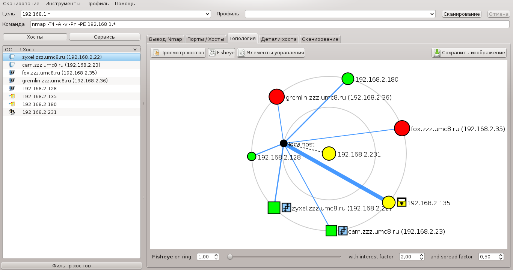
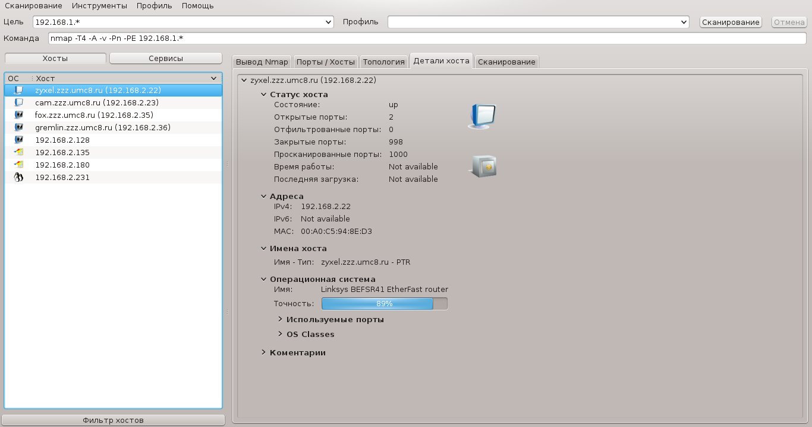
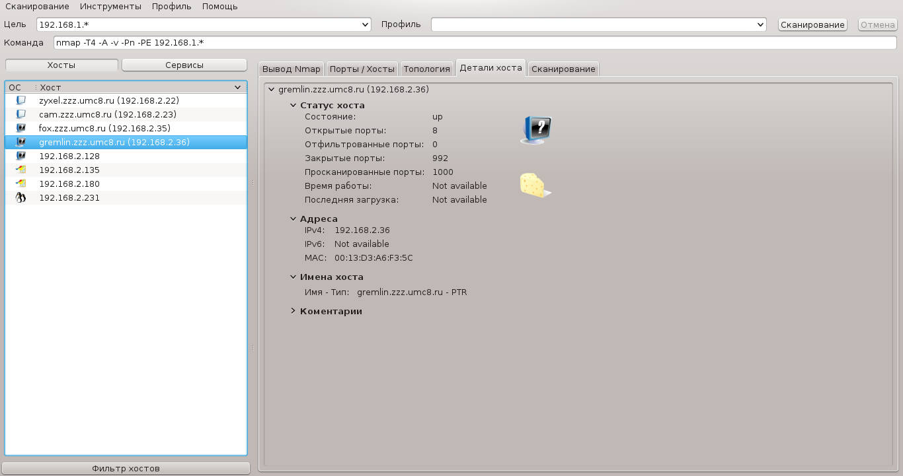
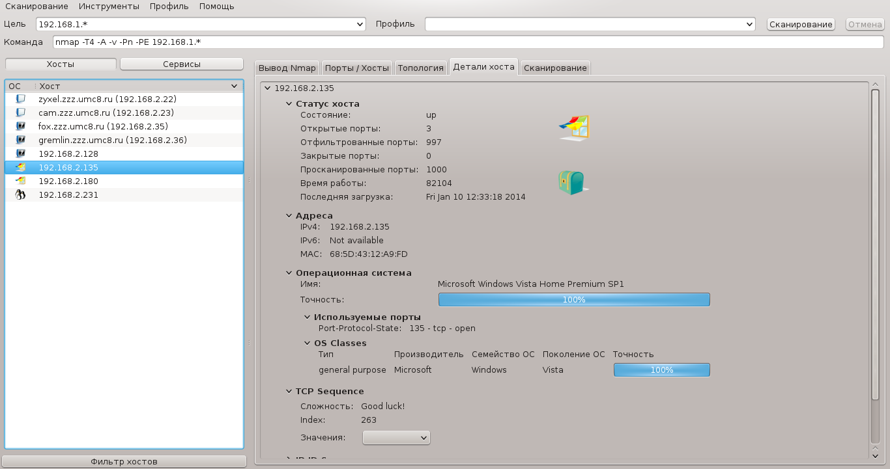
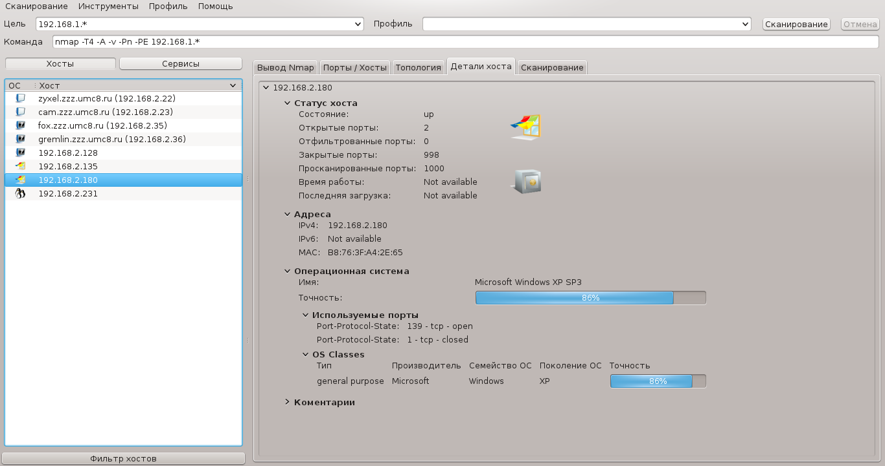

# Сканирование компьютеров в сети

## Ping

Сканирование сети лабораторного класса на наличие компьютеров в сети.

    w495@kuantan:~$ echo 192.168.2.{1..254} | xargs -n1 -P255 ping -c1 | grep "bytes from"
    64 bytes from 192.168.2.23: icmp_seq=0 ttl=255 time=0.424 ms
    64 bytes from 192.168.2.30: icmp_seq=0 ttl=64 time=0.132 ms
    64 bytes from 192.168.2.36: icmp_seq=0 ttl=64 time=0.333 ms
    64 bytes from 192.168.2.50: icmp_seq=0 ttl=64 time=0.034 ms
    64 bytes from 192.168.2.52: icmp_seq=0 ttl=64 time=0.180 ms
    64 bytes from 192.168.2.55: icmp_seq=0 ttl=64 time=0.117 ms
    64 bytes from 192.168.2.56: icmp_seq=0 ttl=64 time=0.201 ms
    64 bytes from 192.168.2.53: icmp_seq=0 ttl=64 time=0.252 ms
    64 bytes from 192.168.2.60: icmp_seq=0 ttl=64 time=0.093 ms
    64 bytes from 192.168.2.59: icmp_seq=0 ttl=64 time=0.072 ms
    64 bytes from 192.168.2.58: icmp_seq=0 ttl=64 time=0.117 ms

# Определение ОС

Возьмем произвольный узел и попытаемся определить, что же на нем за ОС.

    root@kuantan:~# nmap -O -Pn 192.168.2.23
    Nmap scan report for cam (192.168.2.23)
    Host is up (0.00048s latency).
    Not shown: 999 closed ports
    PORT   STATE SERVICE
    80/tcp open  http
    MAC Address: F0:7D:68:00:D4:67 (D-Link)
    Device type: webcam
    Running: TRENDnet embedded
    OS CPE: cpe:/h:trendnet:tv-ip100
    OS details: TRENDnet TV-IP100 webcam
    Network Distance: 1 hop
    OS detection performed. Please report any incorrect results at http://nmap.org/submit/ .

Наш узел оказался вебкамерой. Аналогично можно пройти
и по другим устройствам и сделать это можно с помощью утилиты `zenmap`.

## zenmap

Сканирование проводилось в другой промежуток времени, 
потому перечисленные компьютеры не совпадают с полученными 
с помощью утилиты `ping`.

### 192.168.2.022

### 192.168.2.036

### 192.168.2.135

### 192.168.2.180

### 192.168.2.231

# Определение пути до удаленной машины

Определим путь до `mai.ru`:

    [w495@temerloh ~]$ traceroute mai.ru
    traceroute to mai.ru (217.9.84.137), 64 hops max, 52 byte packets
    1  kuantan (192.168.2.50)  0.084 ms  0.071 ms  0.083 ms
    2  217.9.84.137 (217.9.84.137)  0.610 ms  0.503 ms  0.444 ms

С компьютера temerloh пакеты идут сначала на сервер kuantan, 
и потом попадают стразу на 217.9.84.137 (mai.ru).
В итоге они проходят 2 участка сети (2 хопа).

Для сравнения из моего дома:

    [w495@w495 tmp]$ traceroute mai.ru
    traceroute to mai.ru (217.9.84.137), 30 hops max, 60 byte packets
    1  192.168.1.1 (192.168.1.1)  2.322 ms  25.549 ms  27.728 ms
    2  vpn252-l0.msk.corbina.net (85.21.0.252)  30.170 ms * *
    3  * * *
    4  ko-crs-be12.corbina.net (195.14.54.226)  49.675 ms  49.901 ms 49.348 ms
    5  m9-crs-be2.corbina.net (195.14.54.210)  49.063 ms hq-crs-be3.msk.corbina.net (195.14.62.156)  48.703 ms  808.500 ms
    6  m9-br2-be5.corbina.net (195.14.62.49)  808.703 ms m9-br2-be1.corbina.net (78.107.184.43)  6.782 ms *
    7  83.102.173.246 (83.102.173.246)  8.165 ms corbina-gw-pe06.moscow.gldn.net (83.102.173.242)  167.091 ms corbina-gw-cat07.moscow.gldn.net (195.14.41.6)  172.645 ms
    8  p3.Moscow.gldn.net (79.104.225.69)  167.208 ms p3.Moscow.gldn.net (79.104.235.81)  167.465 ms p4.Moscow.gldn.net (79.104.235.85)  167.720 ms
    9  pe26.Moscow.gldn.net (79.104.225.59)  167.898 ms mai.msk.runnet.ru (194.190.247.106)  186.291 ms pe26.Moscow.gldn.net (79.104.225.59) 168.027 ms
    10  * * *
    11  * * *
    12  217.9.84.137 (217.9.84.137)  63.045 ms  112.030 ms  105.250 ms

И тут получается 12 хопов.

Т.к. лаб. класс физически находится в МАИ, то весьма вероятно,
что кафедральная подсеть и подсеть в которой расположен сайт mai.ru
входят в одну сеть. Что подтверждается экспериментально.

### Что такое Хоп:

Хоп (англ. hop, прыжок) — это участок сети между двумя узлами, 
по которому передаются сетевые пакеты. 
Обычно используется для определения «расстояния» между узлами. 
Чем больше хопов — тем сложнее путь маршрутизации 
и тем «дальше» находятся узлы друг от друга.
